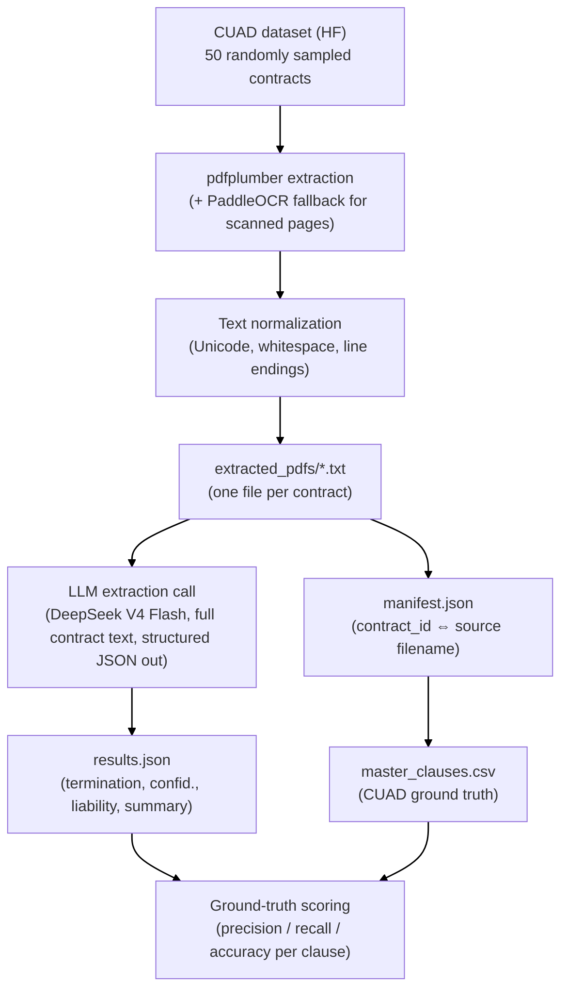

# Document Summariser — CUAD Legal Contract Pipeline

An end-to-end pipeline that reads legal contracts from the CUAD (Contract Understanding Atticus Dataset), extracts termination / confidentiality / liability clauses and a summary using an LLM, and validates the extraction against CUAD's own expert-annotated ground truth.

Built for the AI Intern Take-Home Assignment: Document Processing with LLMs.

---

## Table of Contents

1. [File Organization](#file-organization)
2. [How to Run](#how-to-run)
3. [Solution Flow](#solution-flow)
4. [Design Decisions](#design-decisions)
5. [Results](#results)
6. [Known Limitations](#known-limitations)
7. [Bonus Features — Status](#bonus-features--status)

---

## File Organization

```
.
├── Document_Summariser.ipynb      # Main notebook — the entire pipeline (Parts 1–3)
├── README.md                      # This file
├── master_clauses.csv             # CUAD ground-truth annotations (download separately, see below)
├── extracted_pdfs/                # Generated at runtime by the notebook
│   ├── pdf_0.txt ... pdf_49.txt   #   Cleaned text extracted from each of the 50 sampled contracts
│   └── manifest.json              #   Maps each pdf_N.txt back to its source CUAD filename/category
└── results.json                   # Generated at runtime — final LLM output (deliverable)
```

`results.json` is the primary deliverable: one JSON object per contract with `contract_id`, `termination_clause`, `confidentiality_clause`, `liability_clause`, and `summary`.

---

## How to Run

### 1. Environment

This notebook was developed and run in Jupyter (VS Code / JupyterLab both work fine). Python 3.10+ recommended.

### 2. Install dependencies

The first cell in the notebook installs everything needed:

```
%pip install numpy pandas matplotlib seaborn scikit-learn datasets huggingface pdfplumber paddleocr pdf2image pillow paddlepaddle openai
```

### 3. Get CUAD's ground-truth file

`master_clauses.csv` is CUAD's flattened, expert-annotated ground truth (one row per contract, one column per clause category). It's part of the `CUAD_v1.zip` download from [atticusprojectai.org/cuad](https://www.atticusprojectai.org/cuad). Place `master_clauses.csv` in the same directory as the notebook. (The contract *PDFs* themselves are pulled automatically via the Hugging Face `datasets` library in Part 1 — you don't need to download those separately.)

### 4. Set your API key

The pipeline calls an LLM (DeepSeek V4 Flash) through an OpenAI-compatible API. **Do not hardcode the key** — set it as an environment variable before launching Jupyter:

```bash
# macOS/Linux
export DEEPSEEK_API_KEY="your-key-here"

# Windows (cmd)
set DEEPSEEK_API_KEY=your-key-here
```

The notebook reads it via `os.environ.get("DEEPSEEK_API_KEY", "API_KEY")`.

### 5. Run the notebook top to bottom

Each of the three parts (Data Loading, LLM Extraction, Ground-Truth Evaluation) is clearly sectioned with markdown headers. Running all cells in order will:
- Sample 50 CUAD contracts, extract and clean their text (~a few minutes, OCR fallback pages are slower)
- Call the LLM once per contract to extract clauses + summary (~a few minutes depending on API latency, cost is minimal — DeepSeek V4 Flash is inexpensive)
- Join against `master_clauses.csv` and print precision/recall/accuracy for termination and liability clause detection

The `debug_run()` function in Part 2 is an optional diagnostic tool, not required for the main run — it's there in case a specific contract needs closer inspection (e.g. checking `finish_reason` and token usage on a single contract).

---

## Solution Flow


---

## Design Decisions

### Why pdfplumber + OCR fallback, not OCR-only

Most CUAD contracts have a real text layer, so `pdfplumber` extraction is fast and accurate for the majority of pages. I only fall back to PaddleOCR on pages where `pdfplumber` returns `None` or suspiciously short text (under 10 characters) — this covers scanned/image-only pages without paying the OCR cost on every page.

### Why full contract text, no chunking

CUAD contracts fit comfortably within modern LLM context windows (the longest contract in my 50-contract sample was ~43,000 characters, well under DeepSeek's context limit). I deliberately did **not** chunk or use RAG/embeddings for the core extraction task — chunking is only useful when a document doesn't fit in context, or when you specifically need sub-document retrieval (which is the case for the bonus semantic-search feature, but not for whole-contract clause extraction).

I validated this decision empirically during development: truncating a contract's input text to 6,000 characters caused the model to report a liability clause as "not found," while passing the same contract's full ~43,000 characters correctly surfaced a specific, quotable liability clause (Section 9.3 indemnification language with an exact dollar cap). Truncation actively destroys accuracy here — there's no reason to add that risk when the full text fits in context for free.

### Why one combined LLM call per contract (not one call per clause type)

Asking for all three clauses plus the summary in a single structured-output call is cheaper, faster, and avoids the overhead of making four separate round trips per contract. The risk with a combined call is that the model gives shallow treatment to one field to save effort — I mitigate this by enforcing a strict JSON schema (`CLAUSE_SCHEMA_HINT`) in the prompt, which keeps the model anchored to producing all four fields explicitly rather than free-associating.

### Why an explicit "Not found in contract" instruction

Not every contract has an explicit liability or termination clause. Without an explicit instruction, LLMs tend to hallucinate plausible-sounding boilerplate rather than admitting absence. The prompt directly instructs the model to respond with the literal string `"Not found in contract"` when a clause type genuinely isn't present, rather than inventing content — this also gives me a clean, checkable sentinel value for the health-check and scoring logic downstream.

### Why `max_tokens=4000` (not the initial 800)

Early testing showed some contracts returning completely empty responses. Diagnosing this (via the `debug_run` utility) revealed the model was spending its entire token budget on internal reasoning before ever writing the answer — one contract used all 800 completion tokens purely on reasoning, leaving zero for the actual JSON output (`finish_reason: length`, `reasoning_tokens: 800`). Raising the budget to 4000 solved this cleanly across the whole 50-contract sample.

### Why DeepSeek V4 Flash via API, not a fully local open-source model

I initially tested a small local model (`google/gemma-4-e4b` via LM Studio) to validate the pipeline logic end-to-end without any API cost or key. It worked, but DeepSeek V4 Flash gave meaningfully more reliable structured JSON output and better clause-boundary precision, and turned out to be inexpensive enough that cost wasn't a real constraint for 50 contracts. I kept the local-model code path conceptually (the pipeline is provider-agnostic — swapping `client`/`MODEL_NAME` is a one-line change) but the final submission runs on DeepSeek.

### Why binary presence/absence scoring against ground truth, not text-similarity scoring

CUAD's `master_clauses.csv` `-Answer` columns are binary Yes/No presence flags per clause category, not the full annotated clause text (that lives in CUAD's separate QA-format JSON, which I did not use). Given this, I scored the pipeline as a **binary classification problem** — did the LLM correctly detect whether a clause type exists — using standard precision/recall/accuracy, rather than attempting a text-similarity metric (e.g. ROUGE) against clause text I didn't have ground truth for. This is a real limitation (see below) but a defensible, honestly-scoped one given the data actually available.

### Why the ground-truth CUAD category mapping isn't 1:1 with the assignment's three clause types

This was the most interesting finding during evaluation, and worth documenting clearly:

- **Termination:** CUAD's closest matching category is `Termination For Convenience` — a narrow subset of termination clauses (specifically, termination without cause). My prompt asks for the broader "conditions under which either party may terminate," which also captures termination-for-breach and termination-for-default. Scored against this narrow CUAD category, precision was low (0.34) but recall was perfect (1.0) — the LLM never misses a clause CUAD flags as present; it just also (correctly) finds broader termination language CUAD isn't asking about in this specific column.
- **Liability:** CUAD splits liability into `Uncapped Liability` and `Cap On Liability` — genuinely different (often opposite) concepts. My prompt asks generically for "limitations of liability," which is a much closer semantic match to `Cap On Liability`. Scored against `Uncapped Liability`, precision was 0.45; re-scored against `Cap On Liability`, precision jumped to **0.75** with 0.80 accuracy — empirically confirming this was a category-mismatch issue, not an extraction quality issue.
- **Confidentiality:** CUAD's 41 annotated categories do not include a confidentiality/NDA clause type at all. This isn't a bug in the pipeline or the mapping — it's a genuine gap in CUAD's category taxonomy relative to what the assignment brief asks for. Confidentiality extraction was validated manually by spot-checking outputs against the source contract text, not against ground truth.

I chose to report both the "raw" and "re-mapped" scores transparently rather than cherry-picking the flattering number, because the mismatch itself is a useful, honest finding about how CUAD's categories relate to the assignment's broader clause definitions.

### Manifest filename join and manual overrides

Two contracts out of 50 initially failed to join against `master_clauses.csv` by filename. Both were genuine filename-formatting discrepancies between the downloaded PDFs and CUAD's CSV (an ampersand rendered as an underscore in one filename; a slightly different contract title suffix in the other) — confirmed by direct substring search against the CSV, not guessed. Rather than building general fuzzy-matching logic for a 2/50 edge case, I hardcoded these two as explicit overrides (`FILENAME_OVERRIDES`), which is simpler, more auditable, and appropriately scoped for the size of the discrepancy.

### Error handling philosophy

Every LLM call is wrapped so that a single contract's failure (API error, malformed JSON, empty response) doesn't abort the full 50-contract run — it's recorded as an `"ERROR"` row and the pipeline continues. This means a partial run always still produces usable output for the contracts that succeeded, which matters given real API calls can transiently fail.

---

## Results

Evaluated on all 50 sampled contracts against CUAD's ground truth (`master_clauses.csv`):

| Clause type | Ground-truth category | Precision | Recall | Accuracy |
|---|---|---|---|---|
| Termination | Termination For Convenience | 0.34 | 1.00 | 0.46 |
| Liability | Uncapped Liability | 0.45 | 1.00 | 0.56 |
| Liability | Cap On Liability (re-scored) | **0.75** | 1.00 | **0.80** |
| Confidentiality | *(no CUAD ground-truth category exists)* | — | — | — |

Recall of 1.0 across the board means the pipeline never misses a clause CUAD identifies as present — the lower precision numbers reflect category-granularity mismatches between CUAD's narrow annotated sub-categories and the assignment's broader clause definitions, not missed detections (see [Design Decisions](#design-decisions) above for the full explanation).

---

## Known Limitations

- **Confidentiality clauses are unscored against ground truth** — CUAD simply doesn't annotate this category. Only manually spot-checked.
- **Scoring measures presence/absence, not text correctness** — a contract is scored "correct" if the LLM found *something*, regardless of whether the exact extracted wording is the best possible summary of that clause. Full text-similarity scoring would need CUAD's separate QA-format JSON with actual annotated clause spans, which was out of scope given the take-home's time constraints.
- **Termination and Liability ground-truth categories are narrower than the assignment's own definitions** — see the category-mismatch discussion above. This is a data-availability limitation, not something fixable within the pipeline itself.
- **`max_chars=200_000` is a safety ceiling, not a chunking strategy** — if a contract genuinely exceeded this (none in my 50-contract sample did), it would still be truncated. A production system handling arbitrarily long documents would need real chunking or a map-reduce summarization strategy.

---

## Bonus Features — Status

- **Semantic search over clauses (embeddings):** Not implemented in this submission due to time constraints. If pursued, the natural approach would be to chunk each contract's text, embed each chunk, and build a similarity index (e.g. FAISS) — separate from the whole-document clause extraction pipeline above, since semantic search over sub-document spans is exactly the use case chunking is suited for.
- **Few-shot prompting experiments:** Not implemented in this submission. The current prompt is zero-shot; a natural next step would be adding 2–3 worked examples (contract excerpt → correct extraction) directly in the prompt to see whether precision improves against CUAD's narrower ground-truth categories specifically.